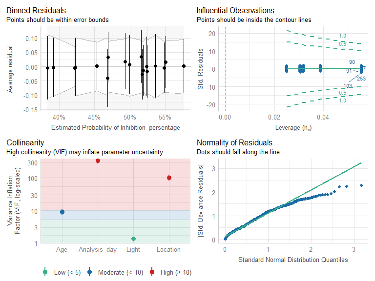

Effect of age and light on the antioxidant activity of *Ilex guayusa*
leaves - Statistical analysis
================
Jefferson Pastuña
2025-01-31

- <a href="#introduction" id="toc-introduction">Introduction</a>
- <a href="#data-preprocessing" id="toc-data-preprocessing">Data
  preprocessing</a>
  - <a href="#linearity" id="toc-linearity">Linearity</a>
  - <a href="#collinearity" id="toc-collinearity">Collinearity</a>

# Introduction

This R Script aims to record the procedure for analyzing the antioxidant
activity of *Ilex guayusa* leaves under different age and light
conditions. Each step has a brief explanation, as well as code and
graphics.

The logistic model proposed by [Study of the DPPH-scavenging activity:
Development of a free software for the correct interpretation of
data](https://doi.org/10.1016/j.foodchem.2008.10.035) was used to
interpret the antioxidant activity result of *Ilex guayusa* leaves. We
do not use the logistic model to calculate the IC50. However, we use the
logistic model (multivariable logistic model) to understand the
relationship between age-light factors and antioxidant activity.

# Data preprocessing

## Linearity

Before the data analysis, we checked the linear relationship between the
sample concentration and the antioxidant activity (measured as an
inhibition percentage). We verified the linear relationship between the
sample concentration and the antioxidant activity because we required
verification that the sample concentration did not interfere with the
independent variables (age and light factor). Also, the logistic
regression assumes the linearity of independent variables and log odds
of the dependent variable.

First, we loaded the data to R.

``` r
# Installing readxl package
#install.packages("readxl")
# Loading readxl package
library("readxl")
# Loading antioxidant data
abts <- read_excel("Data/Antioxidant_data/Antioxidant_to_R.xlsx",
                   sheet = "ABTS_data")
# Change character variables as factor variables
abts$Analysis_day <- as.factor(abts$Analysis_day)
abts$Location <- as.factor(abts$Location)
abts$Age <- as.factor(abts$Age)
abts$Light <- as.factor(abts$Light)
# Loading dplyr package
library(dplyr)
```

    ## 
    ## Attaching package: 'dplyr'

    ## The following objects are masked from 'package:stats':
    ## 
    ##     filter, lag

    ## The following objects are masked from 'package:base':
    ## 
    ##     intersect, setdiff, setequal, union

``` r
# Visual inspection of data
glimpse(abts)
```

    ## Rows: 324
    ## Columns: 6
    ## $ Analysis_day          <fct> Day_1, Day_1, Day_1, Day_1, Day_1, Day_1, Day_1,~
    ## $ Location              <fct> A, A, A, A, A, A, A, A, A, A, A, A, A, A, A, A, ~
    ## $ Age                   <fct> Early, Early, Early, Early, Early, Early, Early,~
    ## $ Light                 <fct> Shade, Shade, Shade, Shade, Shade, Shade, Shade,~
    ## $ Concentration         <dbl> 100.0, 133.0, 166.7, 200.0, 233.3, 300.0, 100.0,~
    ## $ Inhibition_persentage <dbl> 0.3535912, 0.4198895, 0.4033149, 0.5143646, 0.50~

Then, we use the glm function to fit generalized linear models.

``` r
# Build the model
abts_concentration <- glm(formula = Inhibition_persentage ~ Concentration,
                          data = abts,
                          family = quasibinomial(logit))
```

Summary of the model.

``` r
# Summary of the model
summary(abts_concentration)
```

    ## 
    ## Call:
    ## glm(formula = Inhibition_persentage ~ Concentration, family = quasibinomial(logit), 
    ##     data = abts)
    ## 
    ## Coefficients:
    ##                 Estimate Std. Error t value Pr(>|t|)    
    ## (Intercept)   -1.1725816  0.0438538  -26.74   <2e-16 ***
    ## Concentration  0.0059967  0.0002201   27.25   <2e-16 ***
    ## ---
    ## Signif. codes:  0 '***' 0.001 '**' 0.01 '*' 0.05 '.' 0.1 ' ' 1
    ## 
    ## (Dispersion parameter for quasibinomial family taken to be 0.01573875)
    ## 
    ##     Null deviance: 17.2683  on 323  degrees of freedom
    ## Residual deviance:  5.1304  on 322  degrees of freedom
    ## AIC: NA
    ## 
    ## Number of Fisher Scoring iterations: 3

The slope (m = 0.0059967) showed that the antioxidant activity increased
with the sample concentration, and this increase is significant (p-value
\<2e-16). We plot the model using the following line code.

``` r
# Installing sjPlot package
#install.packages("sjPlot")
# Loading sjPlot package
library(sjPlot)
```

    ## Warning: package 'sjPlot' was built under R version 4.4.2

    ## Install package "strengejacke" from GitHub (`devtools::install_github("strengejacke/strengejacke")`) to load all sj-packages at once!

``` r
# Plot of the model
concentration_plot <-
  plot_model(abts_concentration, type = "pred", terms = "Concentration",
             title = "Predicted probabilities of inhibition persentage",
             axis.title = c("Concentration", "Inhibition persentage"))
concentration_plot
```

<!-- -->

The next step will be to confirm the linearity between the sample
concentration and the antioxidant activity.

<table style="border-collapse:collapse; border:none;">
<tr>
<th style="border-top: double; text-align:center; font-style:normal; font-weight:bold; padding:0.2cm;  text-align:left; ">
 
</th>
<th colspan="3" style="border-top: double; text-align:center; font-style:normal; font-weight:bold; padding:0.2cm; ">
Inhibition_persentage
</th>
</tr>
<tr>
<td style=" text-align:center; border-bottom:1px solid; font-style:italic; font-weight:normal;  text-align:left; ">
Predictors
</td>
<td style=" text-align:center; border-bottom:1px solid; font-style:italic; font-weight:normal;  ">
Odds Ratios
</td>
<td style=" text-align:center; border-bottom:1px solid; font-style:italic; font-weight:normal;  ">
CI
</td>
<td style=" text-align:center; border-bottom:1px solid; font-style:italic; font-weight:normal;  ">
p
</td>
</tr>
<tr>
<td style=" padding:0.2cm; text-align:left; vertical-align:top; text-align:left; ">
(Intercept)
</td>
<td style=" padding:0.2cm; text-align:left; vertical-align:top; text-align:center;  ">
0.96
</td>
<td style=" padding:0.2cm; text-align:left; vertical-align:top; text-align:center;  ">
0.93 – 0.99
</td>
<td style=" padding:0.2cm; text-align:left; vertical-align:top; text-align:center;  ">
<strong>0.003</strong>
</td>
</tr>
<tr>
<td style=" padding:0.2cm; text-align:left; vertical-align:top; text-align:left; ">
Concentration \[1st<br>degree\]
</td>
<td style=" padding:0.2cm; text-align:left; vertical-align:top; text-align:center;  ">
1199.52
</td>
<td style=" padding:0.2cm; text-align:left; vertical-align:top; text-align:center;  ">
727.08 – 1982.40
</td>
<td style=" padding:0.2cm; text-align:left; vertical-align:top; text-align:center;  ">
<strong>\<0.001</strong>
</td>
</tr>
<tr>
<td style=" padding:0.2cm; text-align:left; vertical-align:top; text-align:left; ">
Concentration \[2nd<br>degree\]
</td>
<td style=" padding:0.2cm; text-align:left; vertical-align:top; text-align:center;  ">
0.40
</td>
<td style=" padding:0.2cm; text-align:left; vertical-align:top; text-align:center;  ">
0.25 – 0.66
</td>
<td style=" padding:0.2cm; text-align:left; vertical-align:top; text-align:center;  ">
<strong>\<0.001</strong>
</td>
</tr>
<tr>
<td style=" padding:0.2cm; text-align:left; vertical-align:top; text-align:left; ">
Concentration \[3rd<br>degree\]
</td>
<td style=" padding:0.2cm; text-align:left; vertical-align:top; text-align:center;  ">
0.79
</td>
<td style=" padding:0.2cm; text-align:left; vertical-align:top; text-align:center;  ">
0.49 – 1.30
</td>
<td style=" padding:0.2cm; text-align:left; vertical-align:top; text-align:center;  ">
0.360
</td>
</tr>
<tr>
<td style=" padding:0.2cm; text-align:left; vertical-align:top; text-align:left; ">
Concentration \[4th<br>degree\]
</td>
<td style=" padding:0.2cm; text-align:left; vertical-align:top; text-align:center;  ">
1.09
</td>
<td style=" padding:0.2cm; text-align:left; vertical-align:top; text-align:center;  ">
0.67 – 1.78
</td>
<td style=" padding:0.2cm; text-align:left; vertical-align:top; text-align:center;  ">
0.728
</td>
</tr>
<tr>
<td style=" padding:0.2cm; text-align:left; vertical-align:top; text-align:left; padding-top:0.1cm; padding-bottom:0.1cm; border-top:1px solid;">
Observations
</td>
<td style=" padding:0.2cm; text-align:left; vertical-align:top; padding-top:0.1cm; padding-bottom:0.1cm; text-align:left; border-top:1px solid;" colspan="3">
324
</td>
</tr>
</table>

The results showed that the sample concentration and the antioxidant
activity could not have a linear relationship. The result showed that
the linear (p-value \<0.001) and polynomial grade 2 (p-value \<0.001)
models fit the data better.

## Collinearity

Before the data analysis, we also check the collinearity of the whole
data. We use the glm function to fit generalized linear models with all
variables (age, light, location, and analysis day). The analysis day
(due to the extended samples, the analysis of antioxidant activity takes
several days) was included to inspect the collinearity with other
variables.

``` r
# Build the model
abts_m <- glm(formula = Inhibition_persentage ~ Location + Age + Light +
                Analysis_day,
              data = abts,
              family = quasibinomial(logit))
```

The following code helps us to check all model assumptions visually.

``` r
# Installing performance package
#install.packages("performance")
# Loading performance package
library(performance)
```

    ## Warning: package 'performance' was built under R version 4.4.2

``` r
# Check all model assumptions visually
abts_check <- check_model(abts_m)
abts_check
```

<!-- -->
