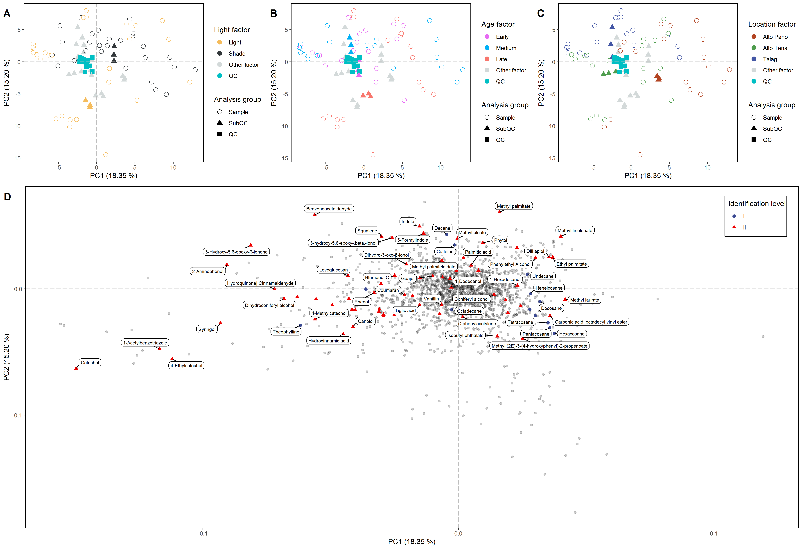

# About this repository

The present document aims to record the procedure given for the statistical analysis of secondary metabolites present in *Ilex guayusa* leaves under different age and light conditions. For each step a brief explanation, the code and graphics obtained are included.

# Analysis Notebooks

- [GC-MS in-house library](https://github.com/IKIAM-NPLab/I_guayusa_volatilome/blob/main/Noteboks/in-house_Library.md)
- [GC-MS spectral deconvolution](https://github.com/IKIAM-NPLab/I_guayusa_volatilome/blob/main/Noteboks/Spectral_Deconvolution.md)
- [Statistical analysis](https://github.com/IKIAM-NPLab/I_guayusa_volatilome/blob/main/Noteboks/Spectral_Deconvolution.md)

# Useful results

## PCA analysis

- GC-EI-(Q)MS

## Heatmaps and HCA

## Volcano plot
