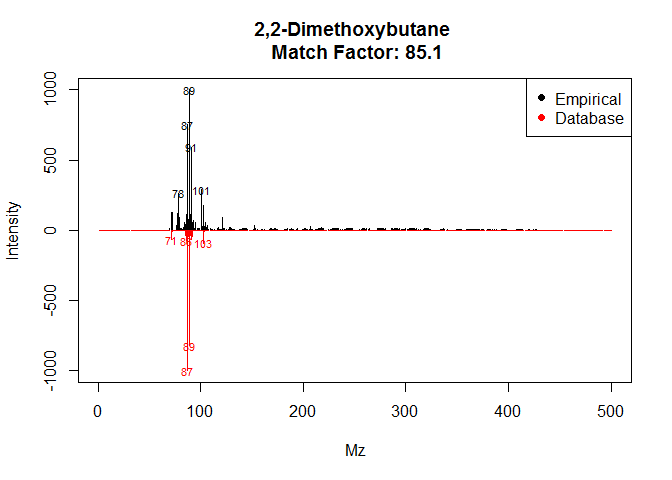

Spectral_Deconvolution
================
Edison Gonzales , Jefferson Pastuna
2024-06-09

- <a href="#introduction" id="toc-introduction">Introduction</a>
- <a href="#before-to-start" id="toc-before-to-start">Before to start</a>
- <a href="#erah-package-workflow" id="toc-erah-package-workflow">eRah
  package workflow</a>

### Introduction
Metabolomics has been driven by mass spectrometry technologies such as gas chromatography coupled to mass spectrometry (GC-MS), allowing it to take an important role in recent years. However, it has been facing challenges in the identification and quantification of metabolites due to the coelution of complex samples and fragmentation of ions, nevertheless, techniques have been developed that allow the analysis of GC-MS data such as "peak-picking" and multivariate deconvolution.(Domingo-Almenara et al., 2016)
Tools such as MZmine, MetAlign and XCMS are used for data processing, but their focus on m/z values and fragmented peak areas makes accurate compound identification difficult. On the other hand, TNO-DECO and ADAP-GC focus on quantification and identification of metabolites from raw data.(Domingo-Almenara et al., 2016)
Therefore, based on the limitations and parameters to be followed, software has been developed that allows a comprehensive and accurate analysis of the data. These include eRah, a free and open source software designed to process data in untargeted GC-MS-based metabolomics. This R package is based on central deconvolution, focusing on blind source separation (BSS), quantification and automated identification of sample spectra by comparison with spectral libraries.(Domingo-Almenara et al., 2016)

### Before to start
eRah is a free R package which incorporates a central deconvolution method, so it uses multivariate techniques based on blind source separation (BSS) which is a process that allows the alignment, quantification and identification of metabolites through the comparison of spectral libraries, which in turn, allows obtaining a table with the names of the compounds, the matching scores and the integrated area of the compound for each sample.(Domingo-Almenara et al., 2016)
The table shows the compound names, coincidence scores and the integrated area of the compound for each sample.


### eRah package workflow

The eRah package is installed and loaded, using "lirary (erah)".
``` r
# eRah package installation
#install.packages('erah')
# eRah library call
library(erah)
```

Delete unwanted files in a specific directory and create a directory with the desired files. 
``` r
# Delete all file that are not in folders
unlink('Data/Data_to_eRah/*')
# Data folder path
createdt('Data/Data_to_eRah/')
```

Data from two CSV files is loaded and processed, creating an experiment object containing this data, tagged with relevant information for the study of the volatilloma of I. guayusa

``` r
instrumental <- read.csv('Data/Metadata_to_eRah/Metadata_inst.csv')
phenotype <- read.csv('Data/Metadata_to_eRah/Metadata_pheno.csv')

raw_data <- newExp(instrumental = instrumental,
                   phenotype = phenotype,
                   info = 'I. guayusa volatilome')
```

Parameters for composite deconvolution are specified, defining specific criteria on peak width and minimum height, noise threshold, and excluding certain ranges of m/z values from processing to improve the accuracy and relevance of chemical analysis.


``` r
dec_par <- setDecPar(min.peak.width = 3,
                     min.peak.height = 500,
                     noise.threshold = 50,
                     avoid.processing.mz = c(50:69,73:75,147:149))
```

To carry out a process in parallel we use the "future" package, which allows us to execute tasks in parallel, improving efficiency and processing speed simultaneously.
``` r
plan(future::multisession,
     workers = 14)
```

We proceed to the deconvolution of compounds in the experimental data (raw_data) using the parameters specified in "dec_par" the results obtained will be saved in (dec_par).


``` r
dec_data <- deconvolveComp(raw_data,
                           dec_par)
```

    ## 
    ##  Deconvolving compounds from Data/Data_to_eRah/Process_Blank/4_Blank.mzXML ... Processing 1 / 101

    ## 
    ##  Deconvolving compounds from Data/Data_to_eRah/Quality_Control/109_QC.mzXML ... Processing 2 / 101

    ## 
    ##  Deconvolving compounds from Data/Data_to_eRah/Quality_Control/110_QC.mzXML ... Processing 3 / 101

    ## 
    ##  Deconvolving compounds from Data/Data_to_eRah/Quality_Control/23_QC.mzXML ... Processing 4 / 101

    ## 
    ##  Deconvolving compounds from Data/Data_to_eRah/Quality_Control/29_QC.mzXML ... Processing 5 / 101

    ## 
    ##  Deconvolving compounds from Data/Data_to_eRah/Quality_Control/35_QC.mzXML ... Processing 6 / 101

    ## 
    ##  Deconvolving compounds from Data/Data_to_eRah/Quality_Control/50_QC.mzXML ... Processing 7 / 101

    ## 
    ##  Deconvolving compounds from Data/Data_to_eRah/Quality_Control/56_QC.mzXML ... Processing 8 / 101

    ## 
    ##  Deconvolving compounds from Data/Data_to_eRah/Quality_Control/62_QC.mzXML ... Processing 9 / 101

    ## 
    ##  Deconvolving compounds from Data/Data_to_eRah/Quality_Control/7_QC.mzXML ... Processing 10 / 101

    ## 
    ##  Deconvolving compounds from Data/Data_to_eRah/Quality_Control/77_QC.mzXML ... Processing 11 / 101

    ## 
    ##  Deconvolving compounds from Data/Data_to_eRah/Quality_Control/8_QC.mzXML ... Processing 12 / 101

    ## 
    ##  Deconvolving compounds from Data/Data_to_eRah/Quality_Control/83_QC.mzXML ... Processing 13 / 101

    ## 
    ##  Deconvolving compounds from Data/Data_to_eRah/Quality_Control/90_QC.mzXML ... Processing 14 / 101

    ## 
    ##  Deconvolving compounds from Data/Data_to_eRah/Quality_Control/96_QC.mzXML ... Processing 15 / 101

    ## 
    ##  Deconvolving compounds from Data/Data_to_eRah/Samples/10_GC_Neg.mzXML ... Processing 16 / 101

    ## 
    ##  Deconvolving compounds from Data/Data_to_eRah/Samples/100_MB_CPos2.mzXML ... Processing 17 / 101

    ## 
    ##  Deconvolving compounds from Data/Data_to_eRah/Samples/101_GC_Neg.mzXML ... Processing 18 / 101

    ## 
    ##  Deconvolving compounds from Data/Data_to_eRah/Samples/102_GC_0.mzXML ... Processing 19 / 101

    ## 
    ##  Deconvolving compounds from Data/Data_to_eRah/Samples/103_GC_Pos.mzXML ... Processing 20 / 101

    ## 
    ##  Deconvolving compounds from Data/Data_to_eRah/Samples/104_GC_2.mzXML ... Processing 21 / 101

    ## 
    ##  Deconvolving compounds from Data/Data_to_eRah/Samples/105_GC_A.mzXML ... Processing 22 / 101

    ## 
    ##  Deconvolving compounds from Data/Data_to_eRah/Samples/106_GC_1.mzXML ... Processing 23 / 101

    ## 
    ##  Deconvolving compounds from Data/Data_to_eRah/Samples/107_GC_C.mzXML ... Processing 24 / 101

    ## 
    ##  Deconvolving compounds from Data/Data_to_eRah/Samples/108_GC_B.mzXML ... Processing 25 / 101

    ## 
    ##  Deconvolving compounds from Data/Data_to_eRah/Samples/11_GC_0.mzXML ... Processing 26 / 101

    ## 
    ##  Deconvolving compounds from Data/Data_to_eRah/Samples/12_GC_Pos.mzXML ... Processing 27 / 101

    ## 
    ##  Deconvolving compounds from Data/Data_to_eRah/Samples/13_GC_2.mzXML ... Processing 28 / 101

    ## 
    ##  Deconvolving compounds from Data/Data_to_eRah/Samples/14_GC_A.mzXML ... Processing 29 / 101

    ## 
    ##  Deconvolving compounds from Data/Data_to_eRah/Samples/15_GC_1.mzXML ... Processing 30 / 101

    ## 
    ##  Deconvolving compounds from Data/Data_to_eRah/Samples/16_GC_C.mzXML ... Processing 31 / 101

    ## 
    ##  Deconvolving compounds from Data/Data_to_eRah/Samples/17_GC_B.mzXML ... Processing 32 / 101

    ## 
    ##  Deconvolving compounds from Data/Data_to_eRah/Samples/18_MB_CNeg0.mzXML ... Processing 33 / 101

    ## 
    ##  Deconvolving compounds from Data/Data_to_eRah/Samples/19_MB_CNeg2.mzXML ... Processing 34 / 101

    ## 
    ##  Deconvolving compounds from Data/Data_to_eRah/Samples/20_MB_APos2.mzXML ... Processing 35 / 101

    ## 
    ##  Deconvolving compounds from Data/Data_to_eRah/Samples/21_MB_BPos1.mzXML ... Processing 36 / 101

    ## 
    ##  Deconvolving compounds from Data/Data_to_eRah/Samples/22_MB_APos1.mzXML ... Processing 37 / 101

    ## 
    ##  Deconvolving compounds from Data/Data_to_eRah/Samples/24_MB_ANeg0.mzXML ... Processing 38 / 101

    ## 
    ##  Deconvolving compounds from Data/Data_to_eRah/Samples/25_MB_CPos2.mzXML ... Processing 39 / 101

    ## 
    ##  Deconvolving compounds from Data/Data_to_eRah/Samples/26_MB_BPos0.mzXML ... Processing 40 / 101

    ## 
    ##  Deconvolving compounds from Data/Data_to_eRah/Samples/27_MB_CNeg0.mzXML ... Processing 41 / 101

    ## 
    ##  Deconvolving compounds from Data/Data_to_eRah/Samples/28_MB_APos2.mzXML ... Processing 42 / 101

    ## 
    ##  Deconvolving compounds from Data/Data_to_eRah/Samples/30_MB_ANeg1.mzXML ... Processing 43 / 101

    ## 
    ##  Deconvolving compounds from Data/Data_to_eRah/Samples/31_MB_APos2.mzXML ... Processing 44 / 101

    ## 
    ##  Deconvolving compounds from Data/Data_to_eRah/Samples/32_MB_APos0.mzXML ... Processing 45 / 101

    ## 
    ##  Deconvolving compounds from Data/Data_to_eRah/Samples/33_MB_CNeg0.mzXML ... Processing 46 / 101

    ## 
    ##  Deconvolving compounds from Data/Data_to_eRah/Samples/34_MB_BPos0.mzXML ... Processing 47 / 101

    ## 
    ##  Deconvolving compounds from Data/Data_to_eRah/Samples/37_GC_Neg.mzXML ... Processing 48 / 101

    ## 
    ##  Deconvolving compounds from Data/Data_to_eRah/Samples/38_GC_0.mzXML ... Processing 49 / 101

    ## 
    ##  Deconvolving compounds from Data/Data_to_eRah/Samples/39_GC_Pos.mzXML ... Processing 50 / 101

    ## 
    ##  Deconvolving compounds from Data/Data_to_eRah/Samples/40_GC_2.mzXML ... Processing 51 / 101

    ## 
    ##  Deconvolving compounds from Data/Data_to_eRah/Samples/41_GC_A.mzXML ... Processing 52 / 101

    ## 
    ##  Deconvolving compounds from Data/Data_to_eRah/Samples/42_GC_1.mzXML ... Processing 53 / 101

    ## 
    ##  Deconvolving compounds from Data/Data_to_eRah/Samples/43_GC_C.mzXML ... Processing 54 / 101

    ## 
    ##  Deconvolving compounds from Data/Data_to_eRah/Samples/44_GC_B.mzXML ... Processing 55 / 101

    ## 
    ##  Deconvolving compounds from Data/Data_to_eRah/Samples/45_MB_APos0.mzXML ... Processing 56 / 101

    ## 
    ##  Deconvolving compounds from Data/Data_to_eRah/Samples/46_MB_BPos2.mzXML ... Processing 57 / 101

    ## 
    ##  Deconvolving compounds from Data/Data_to_eRah/Samples/47_MB_ANeg1.mzXML ... Processing 58 / 101

    ## 
    ##  Deconvolving compounds from Data/Data_to_eRah/Samples/48_MB_CNeg2.mzXML ... Processing 59 / 101

    ## 
    ##  Deconvolving compounds from Data/Data_to_eRah/Samples/49_MB_CPos0.mzXML ... Processing 60 / 101

    ## 
    ##  Deconvolving compounds from Data/Data_to_eRah/Samples/51_MB_CNeg2.mzXML ... Processing 61 / 101

    ## 
    ##  Deconvolving compounds from Data/Data_to_eRah/Samples/52_MB_CNeg1.mzXML ... Processing 62 / 101

    ## 
    ##  Deconvolving compounds from Data/Data_to_eRah/Samples/53_MB_BPos1.mzXML ... Processing 63 / 101

    ## 
    ##  Deconvolving compounds from Data/Data_to_eRah/Samples/54_MB_APos1.mzXML ... Processing 64 / 101

    ## 
    ##  Deconvolving compounds from Data/Data_to_eRah/Samples/55_MB_BNeg0.mzXML ... Processing 65 / 101

    ## 
    ##  Deconvolving compounds from Data/Data_to_eRah/Samples/57_MB_APos1.mzXML ... Processing 66 / 101

    ## 
    ##  Deconvolving compounds from Data/Data_to_eRah/Samples/58_MB_ANeg2.mzXML ... Processing 67 / 101

    ## 
    ##  Deconvolving compounds from Data/Data_to_eRah/Samples/59_MB_BPos2.mzXML ... Processing 68 / 101

    ## 
    ##  Deconvolving compounds from Data/Data_to_eRah/Samples/60_MB_CPos2.mzXML ... Processing 69 / 101

    ## 
    ##  Deconvolving compounds from Data/Data_to_eRah/Samples/61_MB_BNeg1.mzXML ... Processing 70 / 101

    ## 
    ##  Deconvolving compounds from Data/Data_to_eRah/Samples/64_GC_Neg.mzXML ... Processing 71 / 101

    ## 
    ##  Deconvolving compounds from Data/Data_to_eRah/Samples/65_GC_0.mzXML ... Processing 72 / 101

    ## 
    ##  Deconvolving compounds from Data/Data_to_eRah/Samples/66_GC_Pos.mzXML ... Processing 73 / 101

    ## 
    ##  Deconvolving compounds from Data/Data_to_eRah/Samples/67_GC_2.mzXML ... Processing 74 / 101

    ## 
    ##  Deconvolving compounds from Data/Data_to_eRah/Samples/68_GC_A.mzXML ... Processing 75 / 101

    ## 
    ##  Deconvolving compounds from Data/Data_to_eRah/Samples/69_GC_1.mzXML ... Processing 76 / 101

    ## 
    ##  Deconvolving compounds from Data/Data_to_eRah/Samples/70_GC_C.mzXML ... Processing 77 / 101

    ## 
    ##  Deconvolving compounds from Data/Data_to_eRah/Samples/71_GC_B.mzXML ... Processing 78 / 101

    ## 
    ##  Deconvolving compounds from Data/Data_to_eRah/Samples/72_MB_ANeg2.mzXML ... Processing 79 / 101

    ## 
    ##  Deconvolving compounds from Data/Data_to_eRah/Samples/73_MB_BPos2.mzXML ... Processing 80 / 101

    ## 
    ##  Deconvolving compounds from Data/Data_to_eRah/Samples/74_MB_CPos0.mzXML ... Processing 81 / 101

    ## 
    ##  Deconvolving compounds from Data/Data_to_eRah/Samples/75_MB_BNeg1.mzXML ... Processing 82 / 101

    ## 
    ##  Deconvolving compounds from Data/Data_to_eRah/Samples/76_MB_ANeg1.mzXML ... Processing 83 / 101

    ## 
    ##  Deconvolving compounds from Data/Data_to_eRah/Samples/78_MB_APos0.mzXML ... Processing 84 / 101

    ## 
    ##  Deconvolving compounds from Data/Data_to_eRah/Samples/79_MB_BNeg1.mzXML ... Processing 85 / 101

    ## 
    ##  Deconvolving compounds from Data/Data_to_eRah/Samples/80_MB_CPos1.mzXML ... Processing 86 / 101

    ## 
    ##  Deconvolving compounds from Data/Data_to_eRah/Samples/81_MB_BPos0.mzXML ... Processing 87 / 101

    ## 
    ##  Deconvolving compounds from Data/Data_to_eRah/Samples/82_MB_ANeg0.mzXML ... Processing 88 / 101

    ## 
    ##  Deconvolving compounds from Data/Data_to_eRah/Samples/85_MB_BPos1.mzXML ... Processing 89 / 101

    ## 
    ##  Deconvolving compounds from Data/Data_to_eRah/Samples/86_MB_CNeg1.mzXML ... Processing 90 / 101

    ## 
    ##  Deconvolving compounds from Data/Data_to_eRah/Samples/87_MB_BNeg2.mzXML ... Processing 91 / 101

    ## 
    ##  Deconvolving compounds from Data/Data_to_eRah/Samples/88_MB_CPos1.mzXML ... Processing 92 / 101

    ## 
    ##  Deconvolving compounds from Data/Data_to_eRah/Samples/89_MB_BNeg0.mzXML ... Processing 93 / 101

    ## 
    ##  Deconvolving compounds from Data/Data_to_eRah/Samples/91_MB_CNeg1.mzXML ... Processing 94 / 101

    ## 
    ##  Deconvolving compounds from Data/Data_to_eRah/Samples/92_MB_CPos0.mzXML ... Processing 95 / 101

    ## 
    ##  Deconvolving compounds from Data/Data_to_eRah/Samples/93_MB_BNeg0.mzXML ... Processing 96 / 101

    ## 
    ##  Deconvolving compounds from Data/Data_to_eRah/Samples/94_MB_ANeg0.mzXML ... Processing 97 / 101

    ## 
    ##  Deconvolving compounds from Data/Data_to_eRah/Samples/95_MB_BNeg2.mzXML ... Processing 98 / 101

    ## 
    ##  Deconvolving compounds from Data/Data_to_eRah/Samples/97_MB_ANeg2.mzXML ... Processing 99 / 101

    ## 
    ##  Deconvolving compounds from Data/Data_to_eRah/Samples/98_MB_CPos1.mzXML ... Processing 100 / 101

    ## 
    ##  Deconvolving compounds from Data/Data_to_eRah/Samples/99_MB_BNeg2.mzXML ... Processing 101 / 101

    ## Compounds deconvolved

Parameters are defined for alignment and applied to the data.

``` r
# Alignment parameters
alig_par <- setAlPar(min.spectra.cor = 0.9,
                     max.time.dist = 3,
                     mz.range = 50:500)
# Alignment
peak_alig <- alignComp(dec_data,
                       alParameters = alig_par)
```

By means of the "recMissComp" function it is used to recover missing compounds in spectral data, which allows the general model to be adjusted to the compounds present in a minimum number of samples and can consider the spectra of samples where the compound is missing to obtain the final average spectrum.


``` r
peak_find <- recMissComp(peak_alig,
                         min.samples = 3)
```

    ## 
    ##  Updating alignment table... 
    ## Model fitted!

Identification

``` r
# Loading NIST 20 (*.msp) library
nist.database <- importMSP(filename = "E:/NIST_20_Library/Result/NIST20EI_2eRah.MSP",
                           DB.name = "NIST",
                           DB.version = "NIST20",
                           DB.info = "NIST MS Search Export")
# Save library for a posterior faster loading
save(nist.database, file= "E:/NIST_20_Library/Result/NIST20EI_2eRah.rda")
# Load R library
load("E:/NIST_20_Library/Result/NIST20EI_2eRah.rda")
mslib <- nist.database
# Identification
peak_iden <- identifyComp(peak_find,
                          id.database = mslib,
                          mz.range = NULL,
                          n.putative = 20)
```

    ## Constructing matrix database... 
    ## Comparing spectra... 
    ## Done!

``` r
# Identified compound
id_list <- idList(peak_iden)
# Exporting identified compounds
write.csv(id_list,
          file = "Result/eRah_Result/NIST_Identification.csv")
```

Mirror plot of identified compounds

``` r
plotSpectra(peak_iden, 1, 1, draw.color = "red")
```

<!-- -->

Exporting spectra to NIST identification

``` r
export2MSP(peak_iden,
           store.path = "Result/eRah_Result",
           alg.version = 2)
```

    ## Spectra saved at: Result/eRah_Result/ExportMSP
