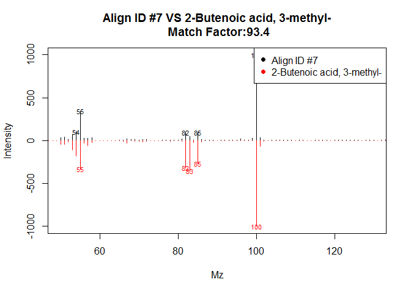

Spectral_Deconvolution
================
Edison Gonzales, Jefferson Pastuna”
2024-06-09

- <a href="#introduction" id="toc-introduction">Introduction</a>
- <a href="#before-to-start" id="toc-before-to-start">Before to start</a>
- <a href="#erah-package-workflow" id="toc-erah-package-workflow">eRah
  package workflow</a>
- <a href="#cleaning-the-identification-list"
  id="toc-cleaning-the-identification-list">Cleaning the identification
  list</a>
- <a href="#tiglic-acid" id="toc-tiglic-acid">Tiglic acid</a>

### Introduction

Metabolomics has been driven by mass spectrometry technologies such as
gas chromatography coupled to mass spectrometry (GC-MS), allowing it to
take an important role in recent years. However, it has been facing
challenges in the identification and quantification of metabolites due
to the coelution of complex samples and fragmentation of ions,
nevertheless, techniques have been developed that allow the analysis of
GC-MS data such as “peak-picking” and multivariate
deconvolution.(Domingo-Almenara et al., 2016) Tools such as MZmine,
MetAlign and XCMS are used for data processing, but their focus on m/z
values and fragmented peak areas makes accurate compound identification
difficult. On the other hand, TNO-DECO and ADAP-GC focus on
quantification and identification of metabolites from raw
data.(Domingo-Almenara et al., 2016) Therefore, based on the limitations
and parameters to be followed, software has been developed that allows a
comprehensive and accurate analysis of the data. These include eRah, a
free and open source software designed to process data in untargeted
GC-MS-based metabolomics. This R package is based on central
deconvolution, focusing on blind source separation (BSS), quantification
and automated identification of sample spectra by comparison with
spectral libraries.(Domingo-Almenara et al., 2016)

### Before to start

eRah is a free R package which incorporates a central deconvolution
method, so it uses multivariate techniques based on blind source
separation (BSS) which is a process that allows the alignment,
quantification and identification of metabolites through the comparison
of spectral libraries, which in turn, allows obtaining a table with the
names of the compounds, the matching scores and the integrated area of
the compound for each sample. The table shows the compound names,
coincidence scores and the integrated area of the compound for each
sample.

### eRah package workflow

The eRah package is installed and loaded, using “lirary (erah)”.

``` r
# eRah package installation
#install.packages('erah')
# eRah library call
library(erah)
```

Delete unwanted files in a specific directory and create a directory
with the desired files.

``` r
# Delete all file that are not in folders
unlink('Data/Data_to_eRah/*')
# Data folder path
createdt('Data/Data_to_eRah/')
```

Data from two CSV files is loaded and processed, creating an experiment
object containing this data, tagged with relevant information for the
study of the volatilloma of I. guayusa.

``` r
# Loading (*.mzXML) chromatograms
#instrumental <- read.csv('Data/Metadata_to_eRah/Metadata_inst_mzXML.csv')
# If (*.mzXML) did not work
# Loading (*.CDF) chromatograms
instrumental <- read.csv('Data/Metadata_to_eRah/Metadata_inst_CDF.csv')
# Loading metadata of the chromatograms
phenotype <- read.csv('Data/Metadata_to_eRah/Metadata_pheno.csv')
# Merge of metadata information with chromatograms
raw_data <- newExp(instrumental = instrumental,
                   phenotype = phenotype,
                   info = 'I. guayusa volatilome')
```

Parameters for composite deconvolution are specified, defining specific
criteria on peak width and minimum height, noise threshold, and
excluding certain ranges of m/z values from processing to improve the
accuracy and relevance of chemical analysis.

``` r
dec_par <- setDecPar(min.peak.width = 3,
                     min.peak.height = 500,
                     noise.threshold = 50,
                     avoid.processing.mz = c(50:69,73:75,147:149))
```

To carry out a process in parallel we use the “future” package, which
allows us to execute tasks in parallel, improving efficiency and
processing speed simultaneously.

``` r
plan(future::multisession,
     workers = 15)
```

We proceed to the deconvolution of compounds in the experimental data
(raw_data) using the parameters specified in “dec_par” the results
obtained will be saved in (dec_par).

``` r
dec_data <- deconvolveComp(raw_data,
                           dec_par)
```

    ## 
    ##  Deconvolving compounds from Data/Data_to_eRah/Process_Blank/4_Blank.CDF ... Processing 1 / 101

    ## 
    ##  Deconvolving compounds from Data/Data_to_eRah/Quality_Control/109_QC.CDF ... Processing 2 / 101

    ## 
    ##  Deconvolving compounds from Data/Data_to_eRah/Quality_Control/110_QC.CDF ... Processing 3 / 101

    ## 
    ##  Deconvolving compounds from Data/Data_to_eRah/Quality_Control/23_QC.CDF ... Processing 4 / 101

    ## 
    ##  Deconvolving compounds from Data/Data_to_eRah/Quality_Control/29_QC.CDF ... Processing 5 / 101

    ## 
    ##  Deconvolving compounds from Data/Data_to_eRah/Quality_Control/35_QC.CDF ... Processing 6 / 101

    ## 
    ##  Deconvolving compounds from Data/Data_to_eRah/Quality_Control/50_QC.CDF ... Processing 7 / 101

    ## 
    ##  Deconvolving compounds from Data/Data_to_eRah/Quality_Control/56_QC.CDF ... Processing 8 / 101

    ## 
    ##  Deconvolving compounds from Data/Data_to_eRah/Quality_Control/62_QC.CDF ... Processing 9 / 101

    ## 
    ##  Deconvolving compounds from Data/Data_to_eRah/Quality_Control/7_QC.CDF ... Processing 10 / 101

    ## 
    ##  Deconvolving compounds from Data/Data_to_eRah/Quality_Control/77_QC.CDF ... Processing 11 / 101

    ## 
    ##  Deconvolving compounds from Data/Data_to_eRah/Quality_Control/8_QC.CDF ... Processing 12 / 101

    ## 
    ##  Deconvolving compounds from Data/Data_to_eRah/Quality_Control/83_QC.CDF ... Processing 13 / 101

    ## 
    ##  Deconvolving compounds from Data/Data_to_eRah/Quality_Control/90_QC.CDF ... Processing 14 / 101

    ## 
    ##  Deconvolving compounds from Data/Data_to_eRah/Quality_Control/96_QC.CDF ... Processing 15 / 101

    ## 
    ##  Deconvolving compounds from Data/Data_to_eRah/Samples/10_GC_Neg.CDF ... Processing 16 / 101

    ## 
    ##  Deconvolving compounds from Data/Data_to_eRah/Samples/100_MB_CPos2.CDF ... Processing 17 / 101

    ## 
    ##  Deconvolving compounds from Data/Data_to_eRah/Samples/101_GC_Neg.CDF ... Processing 18 / 101

    ## 
    ##  Deconvolving compounds from Data/Data_to_eRah/Samples/102_GC_0.CDF ... Processing 19 / 101

    ## 
    ##  Deconvolving compounds from Data/Data_to_eRah/Samples/103_GC_Pos.CDF ... Processing 20 / 101

    ## 
    ##  Deconvolving compounds from Data/Data_to_eRah/Samples/104_GC_2.CDF ... Processing 21 / 101

    ## 
    ##  Deconvolving compounds from Data/Data_to_eRah/Samples/105_GC_A.CDF ... Processing 22 / 101

    ## 
    ##  Deconvolving compounds from Data/Data_to_eRah/Samples/106_GC_1.CDF ... Processing 23 / 101

    ## 
    ##  Deconvolving compounds from Data/Data_to_eRah/Samples/107_GC_C.CDF ... Processing 24 / 101

    ## 
    ##  Deconvolving compounds from Data/Data_to_eRah/Samples/108_GC_B.CDF ... Processing 25 / 101

    ## 
    ##  Deconvolving compounds from Data/Data_to_eRah/Samples/11_GC_0.CDF ... Processing 26 / 101

    ## 
    ##  Deconvolving compounds from Data/Data_to_eRah/Samples/12_GC_Pos.CDF ... Processing 27 / 101

    ## 
    ##  Deconvolving compounds from Data/Data_to_eRah/Samples/13_GC_2.CDF ... Processing 28 / 101

    ## 
    ##  Deconvolving compounds from Data/Data_to_eRah/Samples/14_GC_A.CDF ... Processing 29 / 101

    ## 
    ##  Deconvolving compounds from Data/Data_to_eRah/Samples/15_GC_1.CDF ... Processing 30 / 101

    ## 
    ##  Deconvolving compounds from Data/Data_to_eRah/Samples/16_GC_C.CDF ... Processing 31 / 101

    ## 
    ##  Deconvolving compounds from Data/Data_to_eRah/Samples/17_GC_B.CDF ... Processing 32 / 101

    ## 
    ##  Deconvolving compounds from Data/Data_to_eRah/Samples/18_MB_CNeg0.CDF ... Processing 33 / 101

    ## 
    ##  Deconvolving compounds from Data/Data_to_eRah/Samples/19_MB_CNeg2.CDF ... Processing 34 / 101

    ## 
    ##  Deconvolving compounds from Data/Data_to_eRah/Samples/20_MB_APos2.CDF ... Processing 35 / 101

    ## 
    ##  Deconvolving compounds from Data/Data_to_eRah/Samples/21_MB_BPos1.CDF ... Processing 36 / 101

    ## 
    ##  Deconvolving compounds from Data/Data_to_eRah/Samples/22_MB_APos1.CDF ... Processing 37 / 101

    ## 
    ##  Deconvolving compounds from Data/Data_to_eRah/Samples/24_MB_ANeg0.CDF ... Processing 38 / 101

    ## 
    ##  Deconvolving compounds from Data/Data_to_eRah/Samples/25_MB_CPos2.CDF ... Processing 39 / 101

    ## 
    ##  Deconvolving compounds from Data/Data_to_eRah/Samples/26_MB_BPos0.CDF ... Processing 40 / 101

    ## 
    ##  Deconvolving compounds from Data/Data_to_eRah/Samples/27_MB_CNeg0.CDF ... Processing 41 / 101

    ## 
    ##  Deconvolving compounds from Data/Data_to_eRah/Samples/28_MB_APos2.CDF ... Processing 42 / 101

    ## 
    ##  Deconvolving compounds from Data/Data_to_eRah/Samples/30_MB_ANeg1.CDF ... Processing 43 / 101

    ## 
    ##  Deconvolving compounds from Data/Data_to_eRah/Samples/31_MB_APos2.CDF ... Processing 44 / 101

    ## 
    ##  Deconvolving compounds from Data/Data_to_eRah/Samples/32_MB_APos0.CDF ... Processing 45 / 101

    ## 
    ##  Deconvolving compounds from Data/Data_to_eRah/Samples/33_MB_CNeg0.CDF ... Processing 46 / 101

    ## 
    ##  Deconvolving compounds from Data/Data_to_eRah/Samples/34_MB_BPos0.CDF ... Processing 47 / 101

    ## 
    ##  Deconvolving compounds from Data/Data_to_eRah/Samples/37_GC_Neg.CDF ... Processing 48 / 101

    ## 
    ##  Deconvolving compounds from Data/Data_to_eRah/Samples/38_GC_0.CDF ... Processing 49 / 101

    ## 
    ##  Deconvolving compounds from Data/Data_to_eRah/Samples/39_GC_Pos.CDF ... Processing 50 / 101

    ## 
    ##  Deconvolving compounds from Data/Data_to_eRah/Samples/40_GC_2.CDF ... Processing 51 / 101

    ## 
    ##  Deconvolving compounds from Data/Data_to_eRah/Samples/41_GC_A.CDF ... Processing 52 / 101

    ## 
    ##  Deconvolving compounds from Data/Data_to_eRah/Samples/42_GC_1.CDF ... Processing 53 / 101

    ## 
    ##  Deconvolving compounds from Data/Data_to_eRah/Samples/43_GC_C.CDF ... Processing 54 / 101

    ## 
    ##  Deconvolving compounds from Data/Data_to_eRah/Samples/44_GC_B.CDF ... Processing 55 / 101

    ## 
    ##  Deconvolving compounds from Data/Data_to_eRah/Samples/45_MB_APos0.CDF ... Processing 56 / 101

    ## 
    ##  Deconvolving compounds from Data/Data_to_eRah/Samples/46_MB_BPos2.CDF ... Processing 57 / 101

    ## 
    ##  Deconvolving compounds from Data/Data_to_eRah/Samples/47_MB_ANeg1.CDF ... Processing 58 / 101

    ## 
    ##  Deconvolving compounds from Data/Data_to_eRah/Samples/48_MB_CNeg2.CDF ... Processing 59 / 101

    ## 
    ##  Deconvolving compounds from Data/Data_to_eRah/Samples/49_MB_CPos0.CDF ... Processing 60 / 101

    ## 
    ##  Deconvolving compounds from Data/Data_to_eRah/Samples/51_MB_CNeg2.CDF ... Processing 61 / 101

    ## 
    ##  Deconvolving compounds from Data/Data_to_eRah/Samples/52_MB_CNeg1.CDF ... Processing 62 / 101

    ## 
    ##  Deconvolving compounds from Data/Data_to_eRah/Samples/53_MB_BPos1.CDF ... Processing 63 / 101

    ## 
    ##  Deconvolving compounds from Data/Data_to_eRah/Samples/54_MB_APos1.CDF ... Processing 64 / 101

    ## 
    ##  Deconvolving compounds from Data/Data_to_eRah/Samples/55_MB_BNeg0.CDF ... Processing 65 / 101

    ## 
    ##  Deconvolving compounds from Data/Data_to_eRah/Samples/57_MB_APos1.CDF ... Processing 66 / 101

    ## 
    ##  Deconvolving compounds from Data/Data_to_eRah/Samples/58_MB_ANeg2.CDF ... Processing 67 / 101

    ## 
    ##  Deconvolving compounds from Data/Data_to_eRah/Samples/59_MB_BPos2.CDF ... Processing 68 / 101

    ## 
    ##  Deconvolving compounds from Data/Data_to_eRah/Samples/60_MB_CPos2.CDF ... Processing 69 / 101

    ## 
    ##  Deconvolving compounds from Data/Data_to_eRah/Samples/61_MB_BNeg1.CDF ... Processing 70 / 101

    ## 
    ##  Deconvolving compounds from Data/Data_to_eRah/Samples/64_GC_Neg.CDF ... Processing 71 / 101

    ## 
    ##  Deconvolving compounds from Data/Data_to_eRah/Samples/65_GC_0.CDF ... Processing 72 / 101

    ## 
    ##  Deconvolving compounds from Data/Data_to_eRah/Samples/66_GC_Pos.CDF ... Processing 73 / 101

    ## 
    ##  Deconvolving compounds from Data/Data_to_eRah/Samples/67_GC_2.CDF ... Processing 74 / 101

    ## 
    ##  Deconvolving compounds from Data/Data_to_eRah/Samples/68_GC_A.CDF ... Processing 75 / 101

    ## 
    ##  Deconvolving compounds from Data/Data_to_eRah/Samples/69_GC_1.CDF ... Processing 76 / 101

    ## 
    ##  Deconvolving compounds from Data/Data_to_eRah/Samples/70_GC_C.CDF ... Processing 77 / 101

    ## 
    ##  Deconvolving compounds from Data/Data_to_eRah/Samples/71_GC_B.CDF ... Processing 78 / 101

    ## 
    ##  Deconvolving compounds from Data/Data_to_eRah/Samples/72_MB_ANeg2.CDF ... Processing 79 / 101

    ## 
    ##  Deconvolving compounds from Data/Data_to_eRah/Samples/73_MB_BPos2.CDF ... Processing 80 / 101

    ## 
    ##  Deconvolving compounds from Data/Data_to_eRah/Samples/74_MB_CPos0.CDF ... Processing 81 / 101

    ## 
    ##  Deconvolving compounds from Data/Data_to_eRah/Samples/75_MB_BNeg1.CDF ... Processing 82 / 101

    ## 
    ##  Deconvolving compounds from Data/Data_to_eRah/Samples/76_MB_ANeg1.CDF ... Processing 83 / 101

    ## 
    ##  Deconvolving compounds from Data/Data_to_eRah/Samples/78_MB_APos0.CDF ... Processing 84 / 101

    ## 
    ##  Deconvolving compounds from Data/Data_to_eRah/Samples/79_MB_BNeg1.CDF ... Processing 85 / 101

    ## 
    ##  Deconvolving compounds from Data/Data_to_eRah/Samples/80_MB_CPos1.CDF ... Processing 86 / 101

    ## 
    ##  Deconvolving compounds from Data/Data_to_eRah/Samples/81_MB_BPos0.CDF ... Processing 87 / 101

    ## 
    ##  Deconvolving compounds from Data/Data_to_eRah/Samples/82_MB_ANeg0.CDF ... Processing 88 / 101

    ## 
    ##  Deconvolving compounds from Data/Data_to_eRah/Samples/85_MB_BPos1.CDF ... Processing 89 / 101

    ## 
    ##  Deconvolving compounds from Data/Data_to_eRah/Samples/86_MB_CNeg1.CDF ... Processing 90 / 101

    ## 
    ##  Deconvolving compounds from Data/Data_to_eRah/Samples/87_MB_BNeg2.CDF ... Processing 91 / 101

    ## 
    ##  Deconvolving compounds from Data/Data_to_eRah/Samples/88_MB_CPos1.CDF ... Processing 92 / 101

    ## 
    ##  Deconvolving compounds from Data/Data_to_eRah/Samples/89_MB_BNeg0.CDF ... Processing 93 / 101

    ## 
    ##  Deconvolving compounds from Data/Data_to_eRah/Samples/91_MB_CNeg1.CDF ... Processing 94 / 101

    ## 
    ##  Deconvolving compounds from Data/Data_to_eRah/Samples/92_MB_CPos0.CDF ... Processing 95 / 101

    ## 
    ##  Deconvolving compounds from Data/Data_to_eRah/Samples/93_MB_BNeg0.CDF ... Processing 96 / 101

    ## 
    ##  Deconvolving compounds from Data/Data_to_eRah/Samples/94_MB_ANeg0.CDF ... Processing 97 / 101

    ## 
    ##  Deconvolving compounds from Data/Data_to_eRah/Samples/95_MB_BNeg2.CDF ... Processing 98 / 101

    ## 
    ##  Deconvolving compounds from Data/Data_to_eRah/Samples/97_MB_ANeg2.CDF ... Processing 99 / 101

    ## 
    ##  Deconvolving compounds from Data/Data_to_eRah/Samples/98_MB_CPos1.CDF ... Processing 100 / 101

    ## 
    ##  Deconvolving compounds from Data/Data_to_eRah/Samples/99_MB_BNeg2.CDF ... Processing 101 / 101

    ## Compounds deconvolved

Parameters are defined for alignment and applied to the data.

``` r
# Alignment parameters
alig_par <- setAlPar(min.spectra.cor = 0.9,
                     max.time.dist = 3,
                     mz.range = 50:500)
# Alignment
peak_alig <- alignComp(dec_data,
                       alParameters = alig_par)
```

By means of the “recMissComp” function it is used to recover missing
compounds in spectral data, which allows the general model to be
adjusted to the compounds present in a minimum number of samples and can
consider the spectra of samples where the compound is missing to obtain
the final average spectrum.

``` r
peak_find <- recMissComp(peak_alig,
                         min.samples = 3)
```

    ## 
    ##  Updating alignment table... 
    ## Model fitted!

Identification

``` r
# Loading NIST 20 (*.msp) library
#nist.database <- importMSP(filename = "E:/NIST_20_Library/Result/NIST20EI_2eRah.MSP",
#                           DB.name = "NIST",
#                           DB.version = "NIST20",
#                           DB.info = "NIST MS Search Export")
# Save library for a posterior faster loading
#save(nist.database, file= "E:/NIST_20_Library/Result/NIST20EI_2eRah.rda")
# Load R library
load("E:/NIST_20_Library/Result/NIST20EI_2eRah.rda")
mslib <- nist.database
# Identification
peak_iden <- identifyComp(peak_find,
                          id.database = mslib,
                          mz.range = NULL,
                          n.putative = 20)
```

    ## Constructing matrix database... 
    ## Comparing spectra... 
    ## Done!

``` r
# Identified compounds list
id_list <- idList(peak_iden)
# Exporting identified compounds list
#write.csv(id_list,
#          file = "Result/eRah_Result/NIST_Identification.csv")
```

### Cleaning the identification list

How many metabolites were identified? How we are clean the identified
compound list?

Installation of R package to calculate linear retention index (RI).

``` r
# Installation of "MetaboCoreUtils" package
#install.packages("remotes")
#remotes::install_github("rformassspectrometry/MetaboCoreUtils")

# Loading "MetaboCoreUtils" library
library("MetaboCoreUtils")
```

Explain how retention time of n-alkanes was extract?

Read of retention time list of n-alkanes

``` r
# Loadding rt of each n-alkane
rti <- data.frame(rtime = c(7.557, 10.006, 12.569, 15.111, 17.581, 19.937,
                            22.190, 24.338, 26.399, 28.813, 32.000, 36.327,
                            39.949, 42.506, 44.557, 46.309, 47.852, 49.257,
                            50.554, 51.781, 52.936, 54.182, 55.604),
                  rindex = c(1100, 1200, 1300, 1400, 1500, 1600, 1700, 1800,
                             1900, 2000, 2100, 2200, 2300, 2400, 2500, 2600,
                             2700, 2800, 2900, 3000, 3100, 3200, 3300))
```

Peak of AlignID number 1

``` r
plotProfile(peak_iden, 1)
```

<!-- -->

``` r
# Visual inspection:
# Low quality peak
```

# Tiglic acid

Peak of AlignID number 44

``` r
plotProfile(peak_iden, 44)
```

<!-- -->

``` r
# Visual inspection:
# Good peak shape
```

Mirror plot of alignID number 44

``` r
plotSpectra(peak_iden, 44, 4, draw.color = "red", xlim = c(50,110))
```

<!-- -->

``` r
# Experimental RI = 959 (Calculated by GCMSsolution software)
# Literature RI = 941 (NIST#: 150619)
# ΔRI = 18
```

Exporting spectra to NIST identification

``` r
export2MSP(peak_iden,
           store.path = "Result/eRah_Result",
           alg.version = 2)
```

    ## Spectra saved at: Result/eRah_Result/ExportMSP
